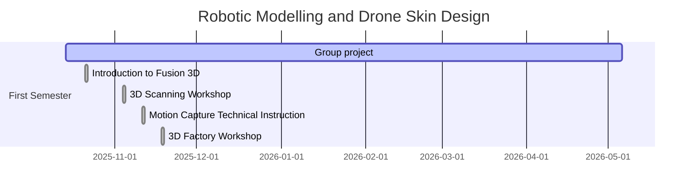

# BSc. AI and Robotics (Hons) - Robotic Modelling and Drone Skin Design

Until I graduate, these pages will document my progress, evaluations and learnings
throughout the _Robotic Modelling and Drone Skin Design_ module of my final year.

